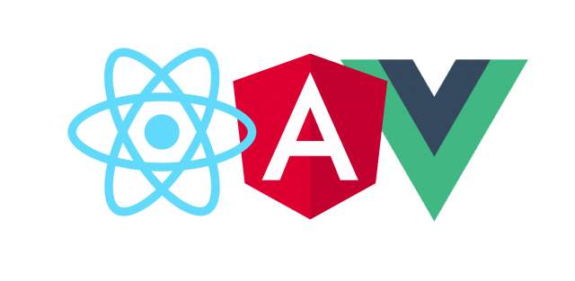
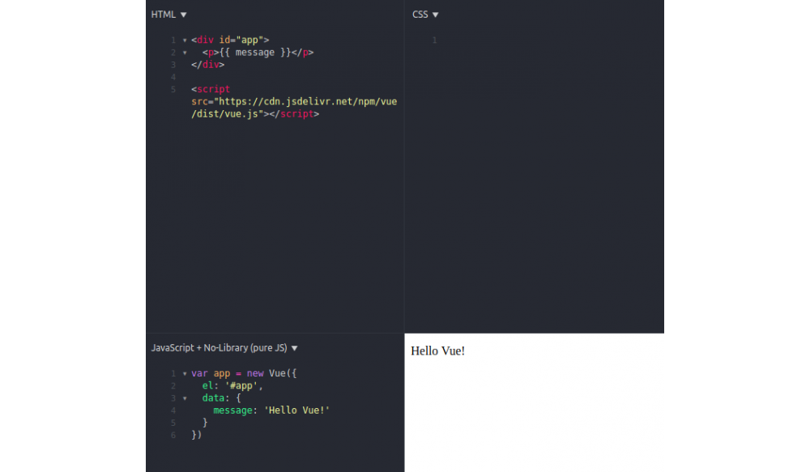

Son zamanlarda, özellikle de web alanında, yeni teknolojiler daha hızlı artmaya başladı. Bu da **React**, **Angular** gibi görece yeni teknolojilerin piyasayı kolayca domine etmesine yol açtı. Artık yeni teknolojiler arasında sürekli gidip geliyoruz, “Hangisini hangi projede kullansam” diye.

**Vue** da bunlardan biri. Gerek esnek yapısı, gerekse kolay öğrenilebilir olması arkasındaki destek Angular (Google) veya React (Facebook) kadar fazla olmasa da Vue.js ile yapılan proje sayısının gün geçtikçe artmasını sağlıyor.



Bu yazıda Vue.js’i tanıyıp muadilleri ile kısaca karşılaştıracağız. En son da basit bir-iki örnek göreceğiz. Ufaktan başlayalım.

# Nedir bu Vue?

Vue.js (Ya da Vue), interaktif web arayüzleri ([progressive web ui](https://en.wikipedia.org/wiki/Progressive_Web_Apps)) oluşturmak için geliştirilmiş bir JavaScript kütüphanesidir. Vue’nun core kısmı sadece view ile ilgilenir, bu yüzden Vue SPA ([single page application](https://en.wikipedia.org/wiki/Single-page_application)) geliştirmek için oldukça iyidir. Tadından yinmez 🙂

Daha teknik bir tanım yapmamız gerekirse Vue, [MVVM](https://en.wikipedia.org/wiki/Model%E2%80%93view%E2%80%93viewmodel) template’inin ViewModel katmanıdır. Two-way data binding dediğimiz bir olayla model ve view katmanlarını birbirine bağlar.


# Peki neden Vue?


* Oldukça kolay öğrenilip projede kullanılabiliyor. [API](https://vuejs.org/v2/api/)’ı Angular’a göre daha açık ve anlaşılır
* Daha esnek bir kullanım sunuyor, bu da yazılımcının uygulama yapısını kendi istediği gibi oluşturmasına izin veriyor. Angular’daki gibi her şeyi onun istediği gibi yapmasına zorlamıyor. Vue genellikle yazılımcının routing, ajax requestler, storage vs. için başka kütüphaneler kullandığını varsayar
* Virtual DOM! Vue DOM manipülasyonu için **virtual DOM** kullanmakta. Yapılacak işlemleri virtual DOM’da uygulayıp asıl DOM’da yapılması gereken en küçük değişiklikleri bulup gerçek DOM’u en kısa şekilde update ederek kaynaktan tasarruf sağlar.
* React’ta da virtual DOM olayı olmakla birlikte ikisinin virtual DOM’a yaklaşma tarzları birbirinden farklı. React -bildiğim kadarıyla- direkt olarak DOM’a müdahale etmeye pek sıcak bakmamakta, bu da özellikle kompleks animasyon içeren uygulamalarda sıkıntı yaratabiliyor. Diğer yandan Vue, bu konuda da React’a göre daha esnek.
* Vue [componentler](https://vuejs.org/v2/guide/components.html) üzerinden uygulama yapısını oluşturmanızı, data mimarisini saklamanızı sağlar. Örneğin navbar, menu, sidebar, form, modal gibi kendi custom componentlerinizi oluşturup kullanabilirsiniz. Ayrıca bu componentler nested bir yapıda da olabilir; bir component bir veya birden fazla componenti içinde bulundurabilir.
* Vue server-side rendering desteklemektedir. Bu da SEO konusunda yazılımcıya kolaylık sağlamakta

> **Not**: Bu saydığım özelliklerden bazıları (server-side rendering, virtual DOM vs.) Vue.js’in
> 2.0 sürümünden sonra eklenmiştir.


*3. parti bir benchmark’a göre bazı web frameworklerin performans sıralaması, düşük olan daha yüksek performanslı. (Kaynak: https://stefankrause.net/js-frameworks-benchmark4/webdriver-ts/table.html)*

# Hello World!

Şimdi de Vue.js’in Hello World’ünü yapalım. Yapacağımız basitçe “Hello Vue!” yazısını içeren bir web sitesi yapmak. 

> **Not**: Ben bu örneği yapması/göstermesi basit olsun diye [jsfiddle](https://jsfiddle.net/)’da yapacağım. Gerçek
> projelerde Vue.js’in nasıl kullanıldığını ise sonraki yazılarda göreceğiz.

Jsfiddle’da HTML kısmına basit bir template yazalım.

```html
<div id="app">
  <p>{{ message }}</p>
</div>
```

Daha sonra Vue.js’in bize verdiği nimetlerden yararlanmak için şu script tagini de HTML kısmına ekliyoruz.

```html
<script src="https://cdn.jsdelivr.net/npm/vue/dist/vue.js"></script>
```

Şimdi de Vue ile datamızı oluşturup template’e bağlayalım. Bunun için JavaScript  kısmına şu scripti yazıyoruz.

```js
var app = new Vue({
  el: '#app',
  data: {
    message: 'Hello Vue!'
  }
})
```

Bu kodlar bize yeni bir Vue **instance**’ı oluşturup **template**’imiz olan `#app` elementine bağlayacak ve verdiğimiz `data`ya göre template’i kullanarak DOM’u oluşturacak.

Sol üstteki **Run** butonuna bastığımız zaman ilk web uygulamamızın çıktısı aşağıdaki gibi olacak.



Burada Vue, `data`'daki `message` değişkenini alarak template’teki yerine koydu ve DOM’u oluşturdu. Eğer koddaki `message` değişkeninin değerini değiştirip tekrar denerseniz sağ alttaki çıktının da değiştiğini göreceksiniz.

Mesela sayfaya kodu çalıştırdığımız zamanı yazdıralım,


Böylece ilk Vue.js projemizi de yapmış bulunuyoruz. Bu serinin ilerleyen yazılarında Vue.js ile daha karmaşık ve güzel projeler yapmayı öğreneceğiz. Bir sonraki yazıda görüşmek üzere.

## Yararlandığım Kaynaklar

* https://vuejs.org/v2/guide/
* https://medium.com/the-vue-point/vue-2-0-is-here-ef1f26acf4b8
* https://stefankrause.net/js-frameworks-benchmark4/webdriver-ts/table.html
* https://blog.cloudboost.io/why-vue-126a612b4ad9

---
*Not: Bu yazı tarafımca yazılıp ilk olarak [yazilimbilimi.org](http://yazilimbilimi.org)'da yayınlanmıştır*